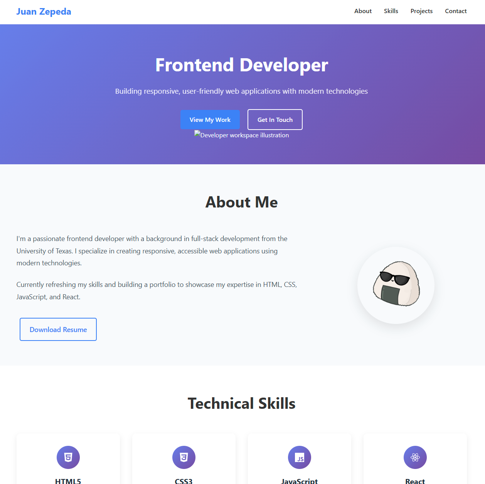
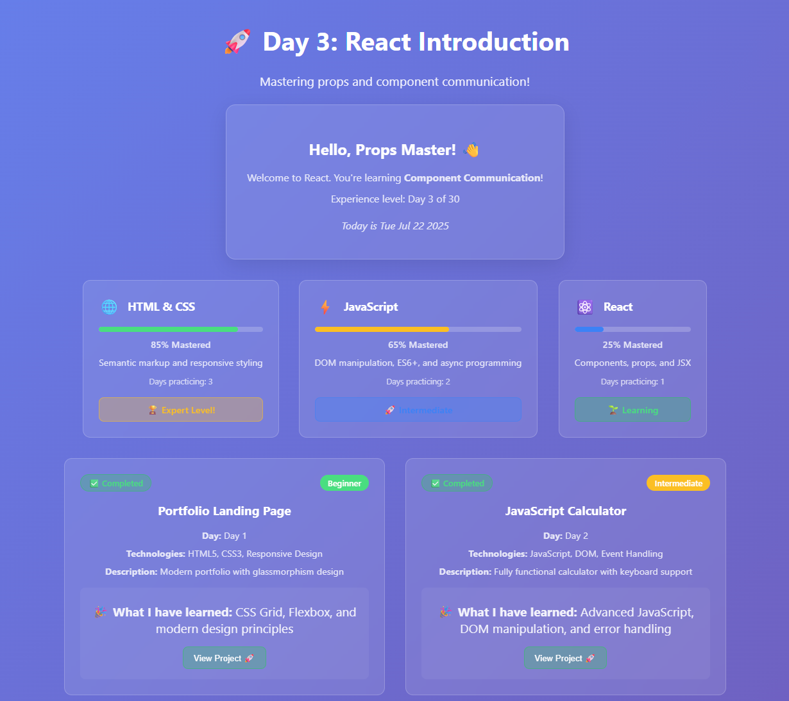

# Personal Portfolio Landing Page

A fully responsive portfolio landing page showcasing my frontend development journey.

## What I Built So Far
- Semantic HTML5 structure
- Complete CSS styling with modern techniques
- Mobile-first responsive design
- Professional layout with hero, about, skills, and contact sections
- Smooth animations and hover effects
- Created a JavaScript Calculator and added that to project 1 in my portfolio website
- Created a React Project with multiple different dashboards and progress trackers using Component, Props, JSX

## Technologies Used
- HTML5 (Semantic elements, accessibility features)
- CSS3 (Grid, Flexbox, CSS Variables, animations)
- Git & GitHub for version control

## Features
- Responsive design that works on all devices
- Smooth scrolling navigation
- Hover effects and animations
- Professional typography and spacing
- Accessible design patterns

## Live Preview
View the site: [Open with Live Server in VS Code]

## Next Steps
- Add JavaScript functionality
- Build responsive navigation menu
- Create interactive elements
- Start first React project

## Progress
- ✅Portfolio Landing Page
- ✅JavaScript Fundamentals
- ⏳React Introduction
- ⏳First React Project

## Screenshots

